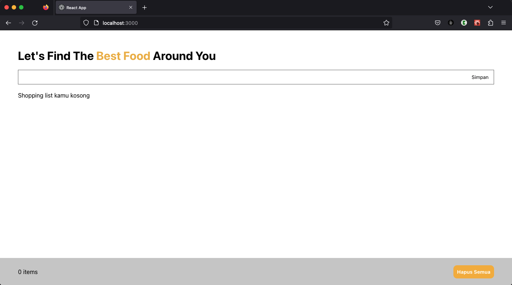
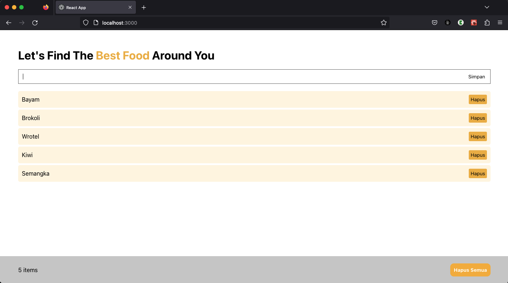

# Belajar React JS Membuat Linktree

Ini adalah seri belajar ReactJS dari basic sampai kita mambuat mini project, yaitu membuat landing page berdasarkan template yang berada di linktree website

## Website Screenshot

**Note: this is for empty shopping list!**

**Note: this is for full shopping list!**

This project was bootstrapped with [Create React App](https://github.com/facebook/create-react-app).

## Available Scripts

In the project directory, you can run:

### `npm start`

Runs the app in the development mode.\
Open [http://localhost:3000](http://localhost:3000) to view it in your browser.

The page will reload when you make changes.\
You may also see any lint errors in the console.
